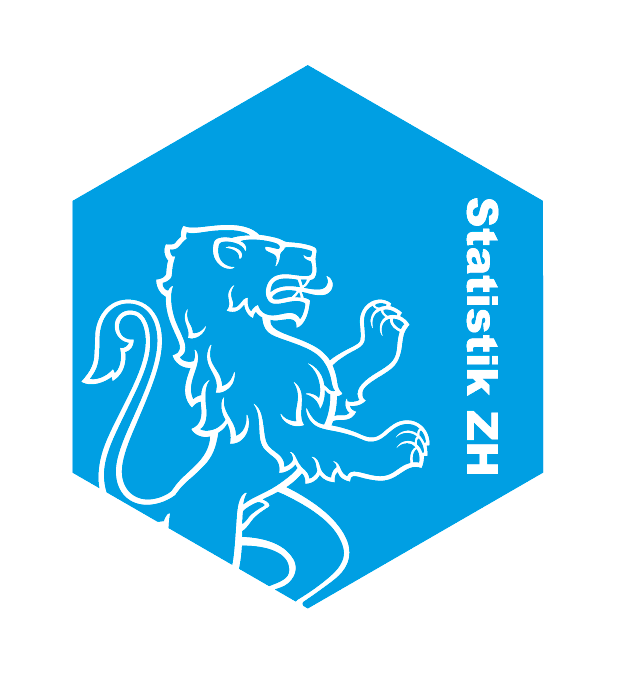

class: top, left

#Agenda


```{r, echo = F}
library(icon)


```


`r icon::fa_files_o(size = 2)`   Reproduzierbarkeit  


    RMarkdown  

`r icon::fa_users(size = 2)`    RCommunity


---
background-image: url(`r icon::fa_files_o(size = 2)`)

class: left, top

# Reproduzierbarkeit

.right[`r icon::fa_files_o(size = 3)`]

- nachvollziehbar
- Kommentare
- Datengrundlage noch vorhanden


---

class: left, top


# PDF-Publikationen


.pull-left[
[<b> statistik.info</b>](https://statistik.zh.ch/internet/justiz_inneres/statistik/de/themen/statistikinfo.html)
- Massgeschneidert
- Eigenständig
- Von einem Verfasser
- Textlastig

.center[]


]

.pull-right[
<font color=#009ee0><b>Monitorings</b></font>
- Automatisiert
- Parametrisierbar
- Reproduzierbar
- v.a. Tabellen und Grafiken

.center[]
]


---

class: top, left

# Workflow

.pull-left[
### Heute
- Diverse R-Skripte
  - Datenaufbereitung
  - Datenauswertungen
  - Grafiken, Karten, Tabellen
- Word-Vorlage
  - Text verfassen
  - Grafiken etc. einfügen
- PDF erstellen
]

--

.pull-right[
### Morgen

- 1 Dokument
  - R-Code
  - Text
  - Grafiken
- Output als Word, PDF, HTML

]


--


.right[.large[<font color=#009ee0>➡ RMarkdown</font>]]


---


class: top, left

# <font color=#009ee0>RMarkdown</font> <br>Idee

.left-column[


]

.right-column[
- Gesamte Analyse inkl. Resultaten an einem Ort
- Kommentare, R Code, Metadaten, Grafiken

- Outputformate: Word, PDF, HTML
- Layoutvorgaben in Templates (LaTex, CSS)

- Vereinfacht Zusammenarbeit
]


---

class: top, left

# <font color=#009ee0>RMarkdown</font> <br> konkret


---

class: top, left

# <font color=#009ee0>Community</font> <br> WWW

- Anzahl Pakete auf CRAN?
- Anzahl Suchfragen auf Stack Overflow


---
background-image: `r icon::fa_meetup(size = 5)`

class: top, left

# <font color=#009ee0>Community</font> <br> Zurich R User Group
### «The use of R in public administration»


`r icon::fa_meetup(size = 5)`

---
background-image: url("libs/sticker-01.png")
background-position: bottom right
background-size:30%

class: top, left

# Vielen Dank <br>für Ihre Aufmerksamkeit!


<br>


`r icon::fa_github(size = 2)`  

https://schnllr.github.io/SST17_Slides  
https://schnllr.github.io/Meetup


<br>


Andrea Schnell  
[andrea.schnell@statistik.ji.zh.ch](mailto:andrea.schnell@statistik.ji.zh.ch)  
043 259 75 58  


<!-- .right[] -->
